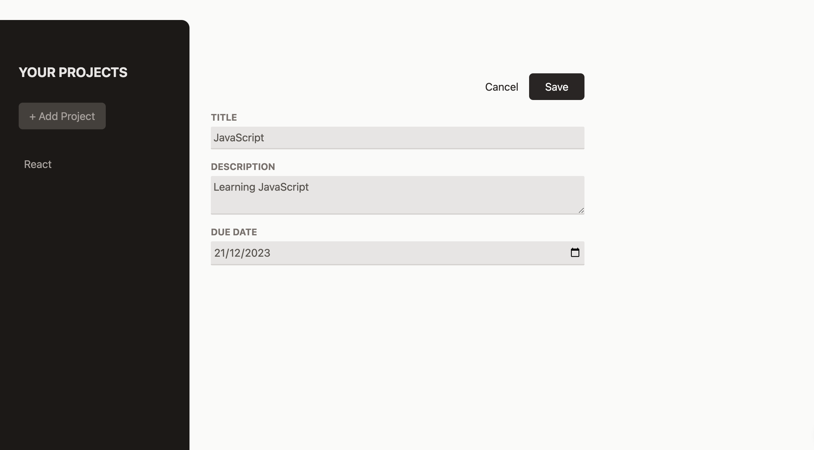
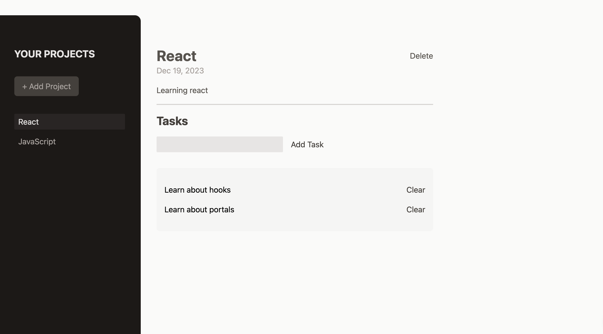

# Project Manager

Welcome to the Project Manager, a simple web application built with React and styled with the Tailwind CSS framework. This project allows users to create new projects, add tasks to them, clean tasks, and delete projects - all within the frontend environment.

## Technologies Used

- **React**: A JavaScript library for building user interfaces.
- **Tailwind CSS**: A utility-first CSS framework for rapidly building custom designs.
- **npm**: A package manager for JavaScript.

## Deployment

Deployed with Github Pages.

_Link:_ https://fercfmsouza.github.io/create-projects/

## Demo

